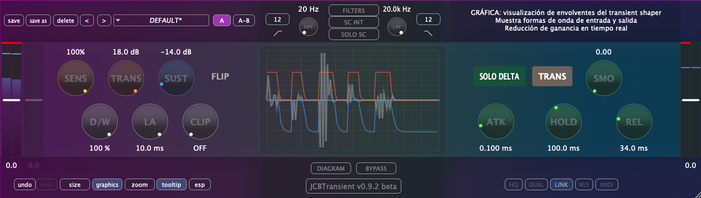

Plugin de diseño de transitorios desarrollado en gen~, exportado con [gen~ Plugin Export](https://github.com/Cycling74/gen-plugin-export) y finalizado con el framework C++ [JUCE](https://github.com/juce-framework/JUCE). Este plugin forma parte de un conjunto de herramientas didácticas que utilizo en la asignatura de Técnicas de Grabación y Masterización para Música Electroacústica del [MCE](https://katarinagurska.com/curso-of/master-de-composicion-electroacustica-mce/). Originalmente creado con JUCE 6 hace unos años, el proyecto ha evolucionado significativamente en su interfaz y funcionalidad gracias al desarrollo con Claude Code durante junio de 2025. Para más detalles técnicos, consulta [NOTAS.md](NOTAS.md).

## Instalación macOS
1. Descarga el archivo DMG desde la página de [Releases](https://github.com/cjitter/JCBTransient/releases)
2. Abre el DMG y ejecuta el instalador
3. El instalador colocará automáticamente los tipos de plugins seleccionados en las ubicaciones correctas del sistema:
   - VST3: `/Library/Audio/Plug-Ins/VST3/`
   - AU: `/Library/Audio/Plug-Ins/Components/`
   - AAX: `/Library/Application Support/Avid/Audio/Plug-Ins/`

*Nota: El DMG está firmado y notarizado para macOS.*

## Requisitos del sistema

- macOS 10.12 o posterior
- Procesador Intel o Apple Silicon
- DAW compatible con VST3, AU o AAX
- Probado en: Pro Tools, Reaper, Logic, Ableton Live y Bitwig

## Compilación desde código fuente

### Requisitos previos
- Git, [CMake](https://cmake.org) 3.20 o posterior, compilador Apple Clang compatible con C++20 (incluido en Xcode 13 o superior).
- [JUCE](https://github.com/juce-framework/JUCE) 8.0.8 (se descarga automáticamente via FetchContent)
- **AAX SDK**, solo requerido para compilar formato AAX - disponible desde cuenta de desarrollador Avid, etc.

### Instrucciones de compilación

1. Clona el repositorio:
```bash
git clone https://github.com/cjitter/JCBTransient.git
cd JCBTransient
```

2. **Configuración del proyecto**:
```bash
# Configurar proyecto Debug (VST3 y AU)
cmake -B build-debug -DCMAKE_BUILD_TYPE=Debug

# Configurar proyecto Release (VST3 y AU)
cmake -B build-release -DCMAKE_BUILD_TYPE=Release

# Configurar proyecto Debug/Release con AAX (requiere AAX SDK y Pro Tools Developer instalado)
cmake -B build-debug -DCMAKE_BUILD_TYPE=Debug -DJUCE_BUILD_AAX=ON
```

**Nota sobre generadores**: Por defecto, CMake usa Unix Makefiles en macOS. También puedes especificar otros generadores:
- **Ninja** (más rápido): `cmake -B build -G Ninja`
- **Xcode** (IDE nativo): `cmake -B build -G Xcode`

**Nota sobre AAX**: Si habilitas AAX, al compilar el plugin se instalará automáticamente en `/Applications/Pro Tools Developer/Plug-Ins/` para pruebas con Pro Tools Developer.

3. **Compilación**:
```bash
# Compilar el proyecto configurado
cmake --build build-debug    # Para Debug
cmake --build build-release   # Para Release
```

## Características principales

- **Diseñador de transitorios** con control independiente de ataque y sustain, ambos en ±18 dB.
- **Control de sensibilidad** (0–100%) para la detección de transitorios.
- **Modo Delta activable** para escuchar únicamente la diferencia entre señal procesada y original (ganancia/reducción aplicada).
- **Delta Mode (TRANS/SUST)**: selecciona qué parte del procesamiento (ataque o sustain) se escucha en modo Delta. Este modo se activa solo cuando Delta está ON.
- **Parámetro Delta automatizable**, guardado en presets (no es un parámetro global).
- **Envolvente configurable** con parámetros de ataque, hold, release y suavizado.
- **Filtro sidechain** interno y externo con HPF y LPF variables (20 Hz – 20 kHz).
- **Control de entrada y salida** (trim y makeup) ±12 dB.
- **Modo lookahead** de 0 a 10 ms para evitar overshooting.
- **Softclip de salida** con distorsión armónica suave.
- **Mezcla Dry/Wet** de 0 a 100% entre señal original y procesada.
- **Procesamiento exclusivamente estéreo**, con canales siempre vinculados.
- **Visualización gráfica** en tiempo real: envolventes de entrada/salida e histograma de procesamiento.
- **Gestión completa de presets** con funciones de guardar, guardar como, eliminar, y navegación.
- **Monitor solo sidechain**, y escucha directa del filtrado sidechain.
- **Bypass interno**, no automatizable, con transición suave.
- **Bypass en Pro Tools** suavizado y alineado con el lookahead para evitar clicks al conmutar.
- **Cambio de idioma** dinámico para tooltips (Español/Inglés).
- **Visualización del diagrama de bloques** con acceso directo al código GenExpr por sección.


## Recursos

### Bibliografía técnica
- [Graham Wakefield & Gregory Taylor - *Generating Sound and Organizing Time*](https://cycling74.com/books/go)
- [Will C. Pirkle - *Designing Audio Effect Plugins in C++*](https://www.willpirkle.com)
- [Giannoulis, Massberg, Reiss - *Dynamic Range Compressor Design*](https://eecs.qmul.ac.uk/~josh/documents/2012/GiannoulisMassbergReiss-dynamicrangecompression-JAES2012.pdf)
- [Matthijs Hollemans - *The Complete Beginner's Guide to Audio Plug-in Development*](https://www.theaudioprogrammer.com/books/beginners-plugin-book)

## Por hacer

- Migrar de Plugin Export a la exportación C++ de RNBO.
- Implementar oversampling con el módulo DSP de JUCE.
- Añadir modos dual y M/S.
- Integrar mapeo MIDI.
- Portar a SuperCollider los bloques de GenExpr o crear un UGen dedicado.

---

*© 2025 Juan Carlos Blancas – JCBTransient v1.0.0*
